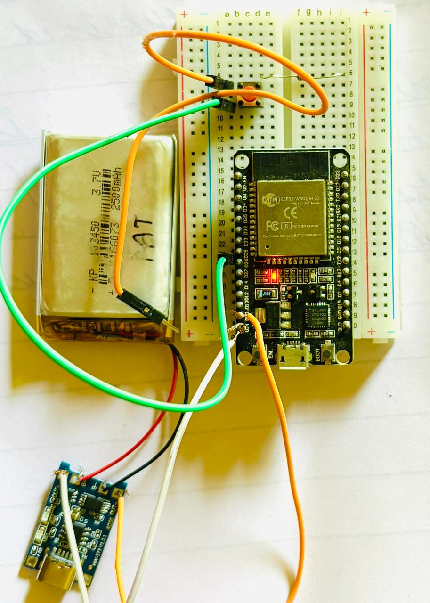
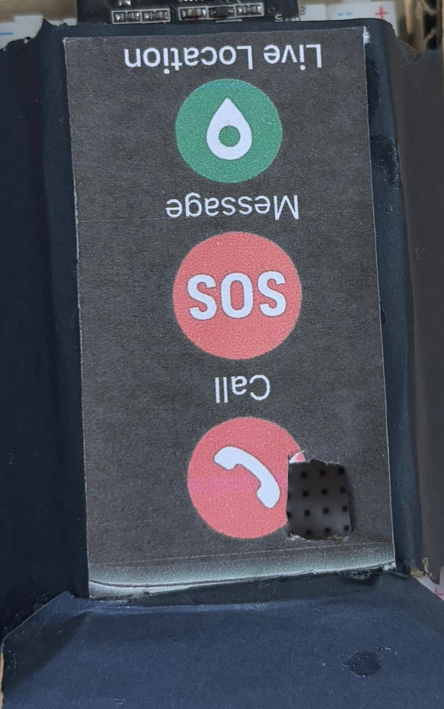
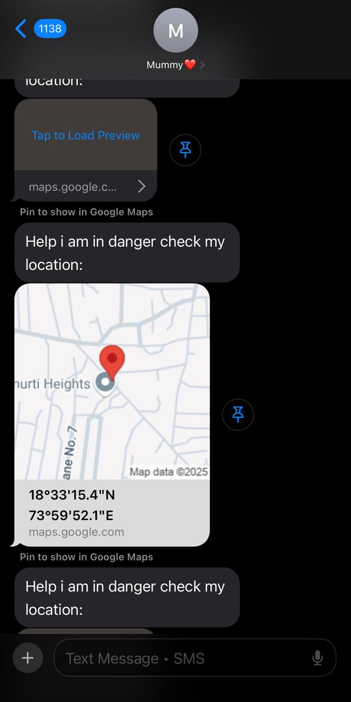
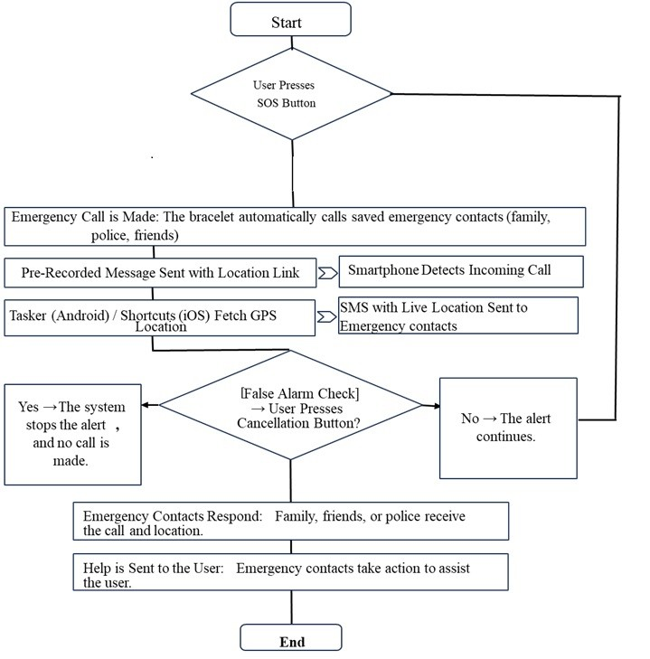

# Women Safety Device - ESP32 IoT Alert System

##  Project Photos

###  Hardware Setup
This shows the ESP32, LiPo battery, button connection, and basic breadboard layout.

---

###  Final Wearable Prototype
A preview of the actual wearable with SOS, Call, and Location design. The button is placed inside for real-time triggering.

##  Live SMS Alert Demo

The following image shows a real-time SMS received with the victim's live location coordinates and Google Maps link — triggered automatically after the emergency button is pressed.

#  Women Safety Device using ESP32 + Twilio

A compact, low-cost, IoT-based emergency alert system built using an **ESP32 DevKit V1**, programmed with **MicroPython**, that automatically sends an **emergency call and SMS** using **Twilio Cloud API** when a button is pressed.

---

## 🔧 Features

-  Automatic **call to guardian** using Twilio Voice API
-  Sends **SMS to victim** instantly
-  Connects to Wi-Fi automatically on power-up
-  Works fully standalone (no laptop, no backend server)
-  Button-activated trigger, ready for wearable design
-  Secure and open-source code (MIT License)

---

##  Circuit Diagram

> Connect a push button between **GPIO26** and **GND**.  
> The onboard blue LED on **GPIO2** is used as an indicator.

---

##  How It Works

1. ESP32 powers on and connects to Wi-Fi.
2. On button press:
   - A **call** is placed to the guardian with a voice message.
   - An **SMS** is sent to the victim.
3. Victim's smartphone (via Tasker) can auto-send live GPS location to police via SMS when a call is received.

---

##  Technologies Used

- MicroPython on ESP32
- Twilio REST API (SMS & Voice)
- HTTP Requests via `urequests`
- Wi-Fi connection using `network`
- Tasker (optional smartphone automation)

---

